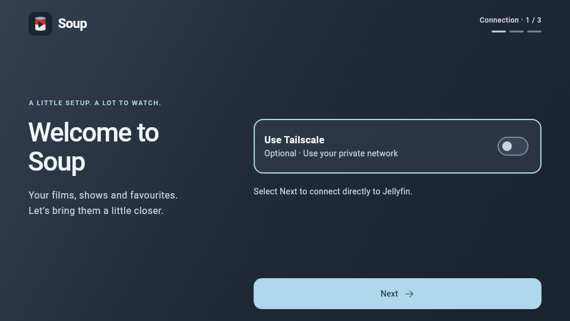
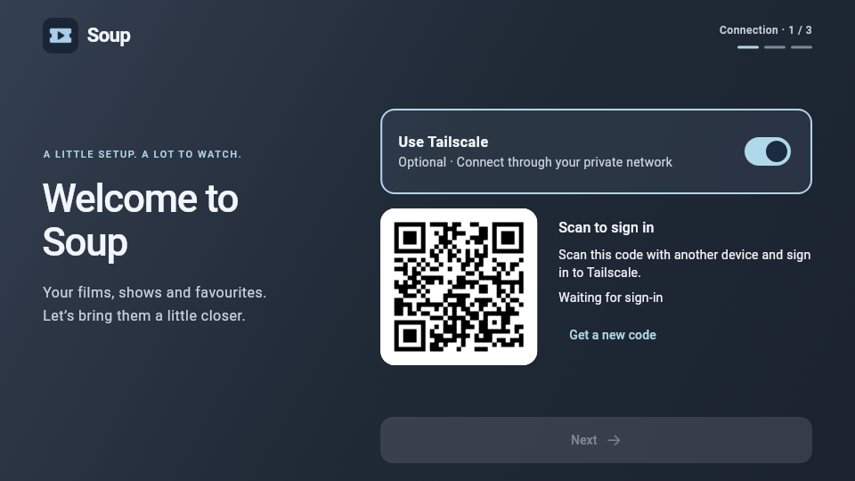
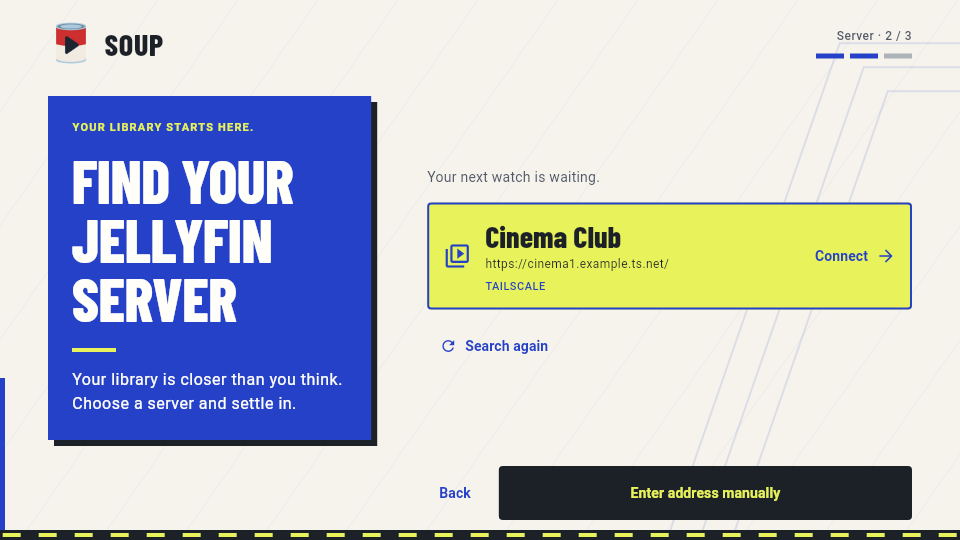
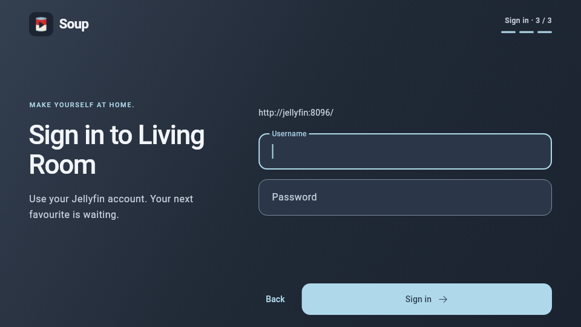
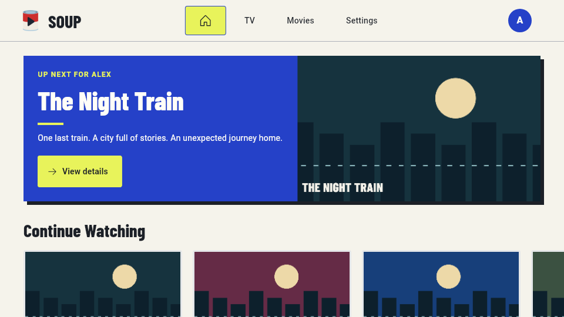

# Soup — Jellyfin, with optional Tailscale

Soup is a Jellyfin client that connects directly to your server or through an
optional embedded Tailscale connection. Embedded Tailscale does not require a
separate VPN app.

## Screenshots

The current Festival design, rendered from the app's Flutter widgets with sample
accounts and library artwork. The QR and Quick Connect codes are demonstrations.

### Onboarding on Android TV

| Choose your connection | Connect with Tailscale (optional) |
| --- | --- |
|  |  |

| Find your server | Sign in |
| --- | --- |
|  |  |

### Sample signed-in homepage



Browse the [complete onboarding gallery](docs/screenshots/onboarding/README.md)
and [Festival gallery](docs/screenshots/festival/README.md) for phone layouts,
additional setup steps, and light and dark themes.

## Supported target

- Android 12+ mobile and Android TV: Flutter/Dart in `apps/android`.
- Embedded networking: Tailscale's C library through the FFI package in `packages/soup_tailscale`.

The Android prototype includes the complete setup path: optional embedded Tailscale,
direct or authenticated app-local SOCKS5 networking, Jellyfin 10.11 discovery, and
Quick Connect or username/password sign-in. The UI depends on a substitutable
`TailscaleClient` boundary and adapts between touch-sized phone layouts and
D-pad-friendly TV layouts. After sign-in, Soup restores the secure session and loads Continue
Watching, Recently Added Movies, and Recently Added TV, including artwork,
through the same selected connection. Libraries open into browsable grids, and item details
show artwork, metadata, overview, Play/Resume, plus season and episode navigation
for series. Playback negotiates direct play with Jellyfin and falls back to HLS
transcoding when required, with resume seeking, transport controls, progress
reporting, and selectable WebVTT subtitles. The authenticated loopback playback
bridge uses the same selected connection as the rest of the app. Tailscale setup
opens authorisation in a browser tab within Soup on mobile and displays a QR code
on TV. Server discovery searches the local network and, when connected, visible Tailscale devices.
Soup tries Jellyfin's built-in discovery first, then standard Jellyfin ports and
Tailscale HTTPS addresses on known devices. Verified servers appear as selectable
cards; manual entry is always available. Discovery is bounded and may not find
unadvertised custom ports, reverse-proxy hostnames or servers behind subnet routers.
It never scans arbitrary LAN address ranges or runs after a saved sign-in is restored.
Manual entry separates the HTTPS/HTTP selector from the address and recognises a
protocol typed into the field. Connection and sign-in errors stay pinned above
the scrollable form so they remain readable at constrained heights.

## Customisable interface

After the first successful Jellyfin sign-in, Soup asks how the authenticated
experience should look. The choice is stored for the device and can be changed
later from Settings without reconnecting or changing accounts.

- **Fruity** is a spacious, artwork-led interface inspired by Apple TV. On TV,
  its top navigation is Home, TV, Movies, and Settings; phones use the same
  destinations in compact bottom navigation.
- **Blockbuster** is a denser, browse-led interface inspired by Netflix. It uses
  a billboard home and an expanding navigation rail on Android TV.
- **Festival** is the default theme: paper, cobalt and acid yellow, condensed
  poster headings and crisp controls. Its light version continues the onboarding
  identity; a coordinated dark version is available for evening viewing.
- Both layouts support Festival, Soup, Ocean, Grove, and Mono palettes, each with
  an explicit light and dark version. Existing saved choices are retained.
- Settings → Use default selects Festival/light with the Fruity layout. Changes
  take effect when you select Apply appearance.

Onboarding and sign-in always use Soup's fixed setup design. Appearance choices
apply only after authentication. The current customisation boundary is layout,
palette, and brightness; custom row ordering, typography, density, and a freeform
layout builder are intentionally deferred.

Secrets are handled deliberately:

- Interactive registration sends no Tailscale credential through Soup. The
  embedded node supplies an HTTPS authorization URL. Phones and tablets open it
  in a Custom Tab using **Authorise device on Tailscale**; Android TV
  renders it as a QR code. Auth-key entry is not offered in Soup onboarding.
- The Jellyfin password is cleared immediately after submission or backward navigation and is never
  persisted.
- The Jellyfin access token and Soup device ID are stored with Android-backed
  secure storage; Android cloud backup is disabled for the app.
- Persistent Tailscale node state lives in the app support directory so a valid
  node can reconnect without another sign-in. The connection choice is stored
  separately; direct sessions never start the embedded Tailscale node.

## Android development

Development workflows are collected in the root `Taskfile.yml`. Install
[Task](https://taskfile.dev/), then discover every available command with:

```sh
task --list
```

The common workflow is:

```sh
task setup       # Initialize libtailscale and install package dependencies.
task qa          # Check formatting, analyze, and run every test suite.
task build       # Build the debug APK.
task run         # Run on the selected Flutter device.
```

Use `task devices` to find a device ID, then pass it as a Task variable when
needed, for example `task run DEVICE=emulator-5554`. Android TV image setup,
keyboard configuration, boot, wait, and shutdown commands are grouped under
`emulator:tv:*`; the defaults create the API 34 ARM64
`Soup_Android_TV_API_34` AVD. This development image boots without Google TV
account onboarding, and the Taskfile explicitly enables host keyboard input.
Run `task --list` for descriptions of package-specific QA, release builds, API
generation, coverage, logging, and cleanup commands.

The equivalent commands without Task are:

```sh
git submodule update --init --recursive
cd apps/android
flutter pub get
flutter analyze
flutter test
flutter build apk --debug
```

The debug APK is written to `apps/android/build/app/outputs/flutter-apk/app-debug.apk`.
See [headless Linux setup](docs/development/android-linux.md) for SDK configuration
and building on a machine with limited memory.
The build hook compiles the pinned upstream `libtailscale` source with Go and
the Android NDK for every ABI requested by Flutter. Android 12 / API 31 is the
minimum supported version.

On first launch, **Use Tailscale** is off. Select **Next** to find a Jellyfin
10.11+ server reachable from your device, or enable Tailscale. On mobile, tap
**Authorise device on Tailscale** to sign in. Soup closes the browser tab when
the device connects or needs administrator approval. If an in-app browser tab is
unavailable, sign-in opens in your external browser; return to Soup manually.
On Android TV, scan the QR code with another device and finish authorization.
Saved accounts that need to reconnect use the same mobile button or TV QR flow.
If device approval is required, Soup waits for the administrator; after connection,
select **Next**. You can turn Tailscale off at any point in that connection step.

Soup checks the server before offering Quick Connect (when enabled on the
server) or username and password sign-in. **Back** lets you edit the server or
connection choice. Both HTTP and HTTPS URLs are supported, with normal
certificate validation and no automatic fallback from Tailscale to direct
networking. Existing saved accounts remain on Tailscale
until you explicitly change the connection choice.

The onboarding layout supports touch, D-pad focus, reduced motion,
and constrained TV heights. [Review screenshots and regeneration instructions](docs/screenshots/onboarding/README.md)
are available for the actual Flutter widgets rendered with demonstration data.
The [discovery verification report](docs/development/android-tv-discovery-2026-09-09.md)
documents network limits, automated coverage and Chromecast checks.

## Jellyfin API generation

The narrow Dart API used by the prototype is generated from
`tool/openapi/jellyfin-10.11-prototype.yaml`. That contract is derived from
Jellyfin's published 10.11.1 OpenAPI snapshot. Generated operations currently
cover public system information and username authentication; the handwritten
facade contains the authenticated library queries and stable app models.

```sh
./tool/generate_jellyfin_api.sh
```

The generated package is committed at `packages/jellyfin_api`. The handwritten
application facade owns authorization headers, version checks, timeouts, and
mapping generated wire models into stable app models.

## Tailscale FFI package

```sh
cd packages/soup_tailscale
flutter analyze
flutter test
```

Upstream library: https://github.com/tailscale/libtailscale

Soup pins the upstream source as a Git submodule. On Android, a small bridge
supplies network-interface information using Java's `NetworkInterface` API,
matching the approach used by the official Tailscale Android client. This is
required because Android sandboxes direct netlink interface discovery.
