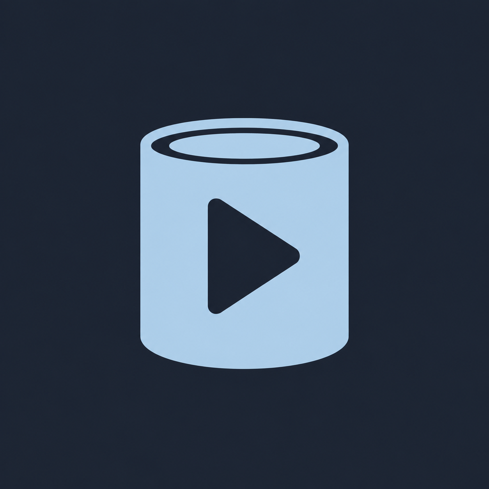

# Soup can / play — alternative concept

SOUP-88: review-only exploration, generated on 2026-09-08.

The follow-up [classic red-and-cream label variant](soup-can-play-v2-campbells.md)
is tracked in SOUP-89 and preserves this original for comparison.



This first can study remains available for comparison. Its red-and-cream SOUP-89
refinement is the selected production mark; this mist-blue-only version is not
bundled in Flutter or referenced by the Android launcher.

Generated using the built-in image generation tool via the imagegen skill,
with the current `apps/android/assets/branding/soup-icon.png` as a style reference.
The selected output is copied unchanged. Like the current mark, it is an opaque
1254 × 1254 raster concept, not a vector master or a trademark-clearance claim.

## Final generation prompt

```text
Use case: logo-brand
Asset type: standalone alternative app-logo concept for Soup, a modern Jellyfin movie and television client.
Input images: Image 1 is a STYLE AND COLOUR REFERENCE ONLY: the approved cinema-ticket/play logo. Do not alter or reproduce the ticket. Generate a new related soup-can concept.
Primary request: a minimalist soup can with a large right-pointing play symbol cut out of its side, in the same friendly rounded style and colours as Image 1. An upright compact cylindrical tin can, softly curved top and bottom, one simple elliptical lid/rim detail sufficient to read as a can. The can body is a confident solid mist-blue silhouette; the play triangle has softly rounded corners and uses the slate background colour. Keep the construction bold and uncluttered so it reads at small app-icon sizes.
Style/medium: flat, precise, vector-like logo graphic with smooth edges, balanced negative space and minimal detail, matching the reference's substantial rounded geometry.
Colour palette: mist blue #AFD9EA on opaque cool slate #202936, only these two colours. No teal, green, apricot, white or metallic silver.
Composition: one centred can, upright with no tilt, seen mostly from the front with just enough view of the top ellipse to read as a cylinder. Symbol approximately 48 percent of canvas width and 60 percent of height with generous margins for an app badge. Solid slate extends edge to edge.
Constraints: no ticket notches, no chain links, no interlocking elements, no S monogram, no lock or shield, no shark fin. No soup bowl, spoon, steam, pull-tab or food illustration. No label text, lettering, words, watermark, mockup or presentation board. No photorealistic metal, lighting, shadows, textures or 3D rendering. Output only the actual square logo concept. Keep the prominent negative-space play symbol as the visual connection to the approved mark.
```
