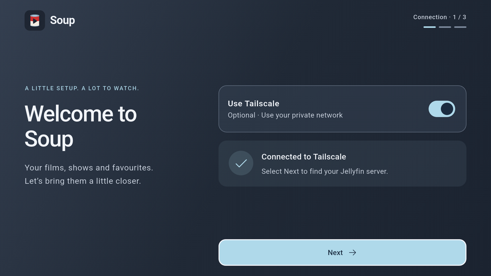
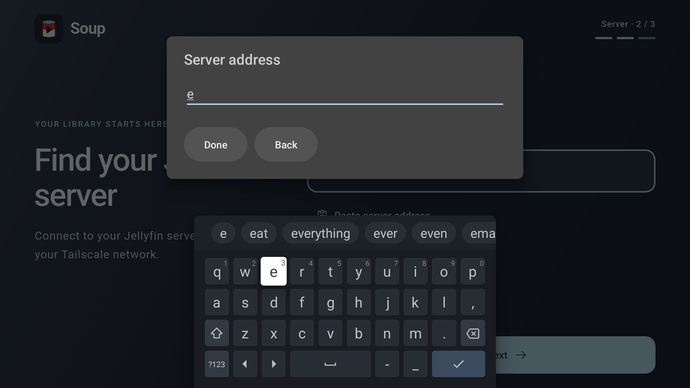
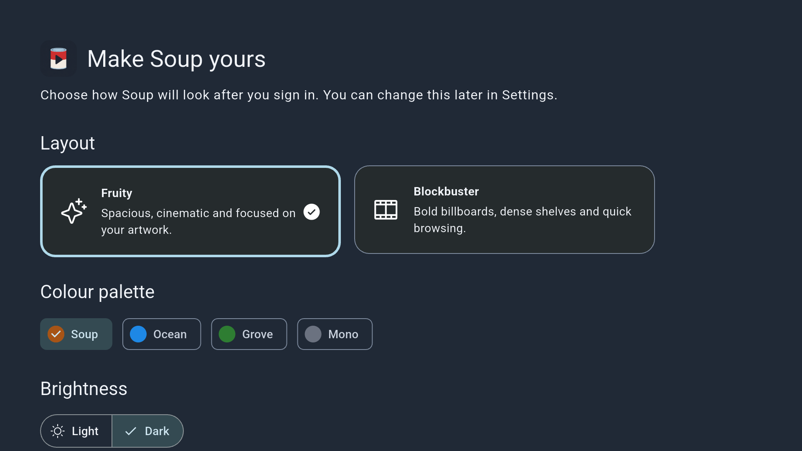
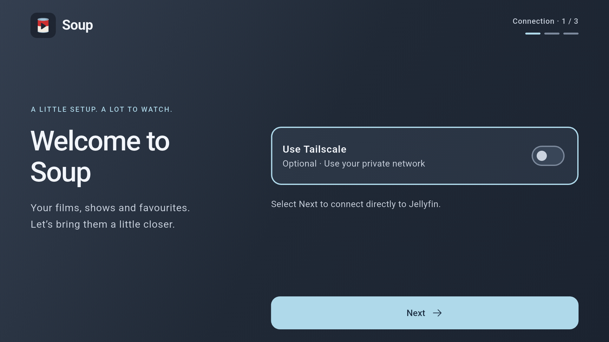

# Guest Room TV native acceptance — 2026-09-08

Tracked by SOUP-18 and the [acceptance matrix](android-acceptance.md).
This is a partial runtime pass; phone coverage and account-dependent TV cases
remain open.

## Device and initial artifact

- User-authorized Chromecast named Guest Room TV, connected using paired ADB
  wireless debugging.
- Android 14 / API 34; native ABI `armeabi-v7a`.
- Physical display 1920×1080, density 320 dpi: Flutter viewport 960×540 logical.
- Default font scale 1.0; device-wide animation settings were not changed.
- No Soup package was installed before this test. The prepared debug APK
  installed successfully without replacing or clearing an existing Soup session.
- Application `dev.michaelishri.soup`, version 1.0.0 (1); application source
  baseline `6a472e7432c4fbaeaecf526bc76f09a175ebfc6c`.
- APK SHA-256:
  `6e37150e82aab55acb908e523967ff4a44e72324518ea43f54029f7fa6ba91ea`.

## Initial observations

1. Native installation and launch succeeded. The first cold debug launch
   exceeded `am start -W`'s approximately ten-second wait, but the app rendered
   and became ready afterward. Startup logs showed successful secure-storage
   initialization with zero existing items and skipped frames during startup;
   this is not release-performance evidence.
2. The selected red-and-cream can/play logo and slate/mist-blue welcome layout
   rendered on the physical TV. Android resolved Soup's `LEANBACK_LAUNCHER`
   intent to its main activity. Launcher tile/mask inspection remains pending.
3. D-pad Down focused the Tailscale switch with a visible blue outline; Down
   moved to Next and Select advanced to the direct server form. The native TV
   keyboard appeared. A Back path returned to the connection step. Full form
   validation, draft preservation and keyboard behavior were not established
   by this initial pass.
4. D-pad Up/Select enabled Tailscale. The embedded native library produced a
   real sign-in QR and a waiting-for-sign-in state. Next was disabled until
   connection. The QR bounds and New code action remained within the viewport.
   The user subsequently completed authorization and reported the two input
   defects addressed below.

## SOUP-90: native onboarding corrections

The original build reproduced both reports: connection success left focus on
the Tailscale switch, and the Flutter field captured arrows while Gboard was
visible. The corrected build focuses Next on connection success or return to
an established connection. Repeated connected statuses preserve the user's
subsequent focus choice.

On TV, a field is now a labelled focus stop: Select opens an Android native
editor, arrows navigate Gboard, and Back closes the editor while retaining the
draft. Username Next opens Password; server/password Done submits that step.
Invalid forms return focus to the field without reopening the keyboard. A
failed sign-in clears the password and focuses it for retry, preserving the
username. The native editor uses Soup's blue accent, and the form stays in place
behind it. Phone form fields retain normal Flutter editing and keyboard insets.

The native pass also found that appearance setup initially focused Continue
below the 960×540 viewport. Down could not reveal it because focus was already
at the end. Initial focus now starts on the visible selected layout, allowing
normal downward traversal and scrolling through the choices to Continue.

### Final build

- Implementation source is the SOUP-90 commit containing this report, based on
  parent `65cd68bfde55227bf6b6b635d7c66dcf3dbb499f`.
- Debug APK: 275,931,447 bytes; SHA-256
  `9793d9c49629f3f0b0e81bca1bfd4f748d9eed2d8ab99f4f57abc6bc59fda9e9`.
- Built with the documented Linux low-memory configuration, then installed
  with `adb install -r`. Existing native Tailscale enrollment was retained;
  no uninstall, app-data clear or fresh authorization was required.
- `task qa`: formatting and all three analyzers passed; 151 tests passed
  (132 app, 7 Tailscale, 12 Jellyfin API).
- Regression cases include success focus, Back to connected setup, repeated
  statuses, field traversal without opening an IME, duplicate Select, cancelled
  drafts, empty-address validation, username/password handoff, failed sign-in,
  stale edits after phase changes, phone flow, short layouts and reduced motion.
  Both appearance presets also exercise initial visible focus and D-pad-only
  scrolling/submission on the real TV's logical viewport size.

### Native results

Testing used the paired Guest Room TV only. A disposable Jellyfin-shaped HTTP
fixture on the development machine supplied public server information and
accepted/rejected test authentication. Requests reached it through the app's
embedded Tailscale transport. It held no real user credentials or media.

| Check | Result |
| --- | --- |
| Existing enrollment after replacement/restart | Passed; restored without another sign-in QR and reached the server step. |
| Back to connected setup | Passed; Next visibly outlined and reported focused by Android accessibility. |
| Tailscale off/on | Passed; restored the saved node; Select continued to the server instead of toggling Tailscale. |
| Field traversal | Passed; focus alone leaves the keyboard closed. Select opens the native editor. Field labels are exposed as accessible actions. |
| Keyboard arrows | Passed; Right, Right, Select entered `e` from Gboard's initial `q` position on the final APK. Vertical navigation and keyboard action keys also worked. |
| Back and reopen | Passed; one Back closed the IME/dialog and retained the draft; Select reopened the same field. |
| Invalid server | Passed; keyboard Done on a blank address produced an inline validation error and returned field focus without reopening the keyboard. |
| Username Next | Passed; remote-only entry of a test username followed by the keyboard Next action opened the password editor. |
| Rejected password | Passed; one authentication request per submission, readable inline error, username retained, password cleared, and password focused on the final APK. |
| Password draft privacy | Passed; D-pad entry followed by Back retained a masked four-character draft, including in Android accessibility; Select reopened the editor. |
| Successful retry | Passed; keyboard Done submitted the reopened password draft, one fixture authentication succeeded, and the app reached appearance setup. |
| Appearance entry/traversal | Passed on the final APK; the visible Fruity card started focused, three Down presses scrolled to visible focused Continue. The equivalent Blockbuster path also has regression coverage. |
| Appearance completion | Passed; Select on Continue opened the native library's empty state and fetched fixture library endpoints. This is UI/transport evidence, not real-media acceptance. |
| Settings destination | Passed; Up/Right/Select reached Settings from the fixture's empty Home. The full settings form traversal/persistence matrix remains unaccepted. |

Cleanup used Change server or account to remove the disposable Jellyfin
session, then restored the exact preferences snapshot taken before choosing
an appearance. The fixture service was stopped. Tailscale enrollment and the
first-use appearance choice remain available for the user's real sign-in.

Native reduced-motion/enlarged-text settings, phone hardware, real Jellyfin
browsing/playback, the full appearance matrix, legacy sessions and separate
administrator-approval/multiple-tailnet cases remain open in SOUP-18. Debug
cold starts showed skipped frames and resource extraction delays; release
startup/performance has not been established by this session.

### Corrected native screenshots

Keyboard/focus evidence APK SHA-256:
`91064922b60b2900e336905205ca813a582bf433e200e2acfc22324913737830`.
The final artifact adds the appearance focus correction described above.

These are unmodified ADB captures from the keyboard/focus build before the
additional appearance focus correction. The editor contains only the
demonstration character entered with the D-pad.

Final APK, with the visible appearance choice focused:

## Native screenshot

This is an unmodified ADB capture from the Chromecast, with the Tailscale switch
focused. It contains no account information or live authorization QR.

Live QR captures, pairing credentials, device network identifiers and raw
runtime logs are excluded from repository evidence. Final visual acceptance is
still pending in SOUP-18.
