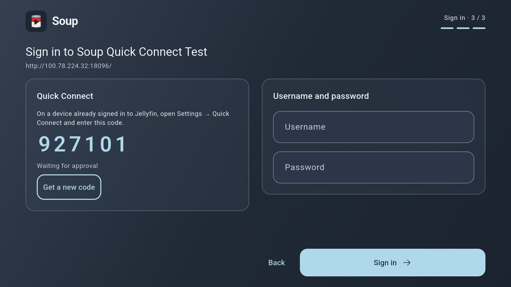
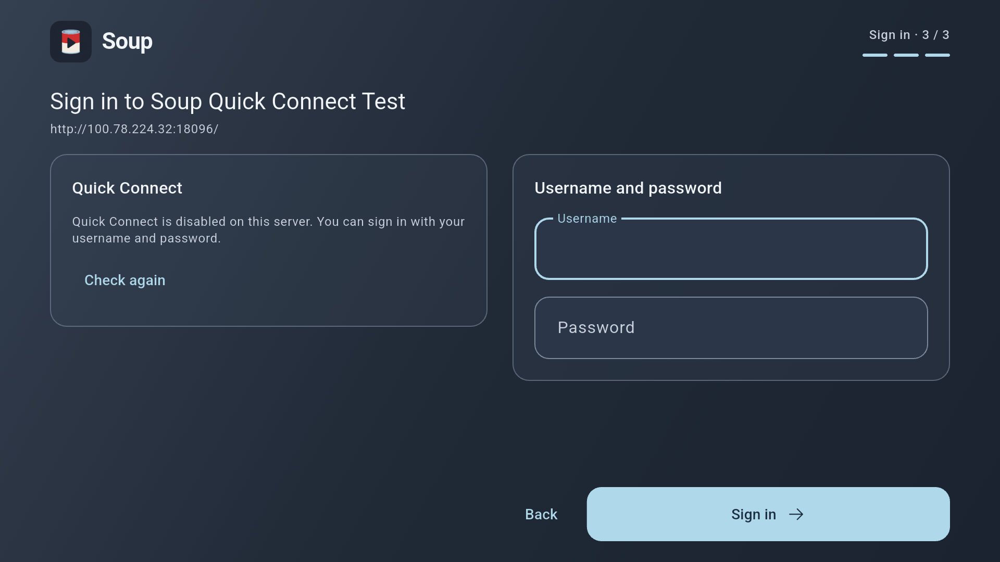

# Guest Room TV: Quick Connect acceptance, 2026-09-08

Ticket: SOUP-91, supporting SOUP-18. Device: Guest Room TV (Chromecast/sabrina, Android 14/API 34, armeabi-v7a), 1920×1080 physical / 960×540 logical, default font scale. Package: `dev.michaelishri.soup`.

The test server was an actual disposable `jellyfin/jellyfin:10.11.1` instance, reached from Soup through embedded Tailscale. A separate authenticated client on the development host approved the displayed codes. This exercises the real Jellyfin request and authentication exchange, not the unit-test protocol fixture. No existing library or user credentials were used.

## Automated checks

- `task qa`: formatting, all analyzers, 179 app tests, 7 Tailscale tests and 24 generated API tests passed (210 total).
- `task api:check`: regeneration produces no changes.
- Debug APK build and replacement install succeeded. Final APK SHA-256: `b8fa05e6f1226fdcd652a2e1c05e895eb7b6e81518f03a64e33ece903bb48597`.

## Native observations

- Server verification automatically produced a real code, with equal sign-in panels fully visible and Username focused. No keyboard opened on arrival.
- Moving down to Password and back to Username left Quick Connect active. Selecting Username paused it before opening the native editor.
- D-pad Right/Down moved the Gboard highlight to a keyboard key. The native editor retained its text and continued to own keyboard navigation.
- Approving the real request while that editor was open did not dismiss it or navigate. One Back returned the username draft, focus and paused Quick Connect panel.
- D-pad Left reached Resume. Selecting it checked the approved request and automatically reached appearance setup, with the selected layout focused. Jellyfin reported an authenticated Soup Android session for the disposable test user.

The observations above used the first feature APK (`f93e72d7855d3d2a9829dd6fed3664444b1e566a36d8f5058d50556d7c43caf9`). The final APK additionally preserves focus during code refresh; final artifact checks and cleanup follow below.

Phone layouts, enlarged text, timeout/expiry, HTTP failures, server/transport changes and interrupted storage writes have automated coverage. This record does not claim physical-phone or media-playback acceptance; those remain under SOUP-18.

## Final artifact checks

- Replacement installation retained the authenticated Quick Connect session and restored appearance setup after Tailscale reconnected. Three D-pad Down presses reached Continue; selecting it opened the empty test library.
- With Quick Connect disabled on the real server, the left panel explained its unavailability and offered Check again. Username remained initially focused and both password fields and Sign in stayed enabled.
- Re-enabling the server feature and selecting Check again produced a new code and kept focus on the Quick Connect action. Selecting Get a new code replaced it again and retained the action's focus.
- Pressing Home backgrounded Soup. The approving client authorized that refreshed request. Returning to Soup completed sign-in automatically and reached the existing appearance's library, with no extra Next or Sign in press.
- Android error logs contained no Flutter or Android runtime errors during these checks.

Settings scrolling and account removal used pointer input for cleanup; this does not establish full Settings D-pad acceptance.

## Cleanup and screenshots

The disposable account was removed through Change server or account. The exact preferences snapshot taken before testing was restored, retaining the user's Tailscale configuration and original appearance state. The disposable Jellyfin container and approving credentials were removed. Screenshots were copied into the repository only after removing that server; the displayed test code is inert.

