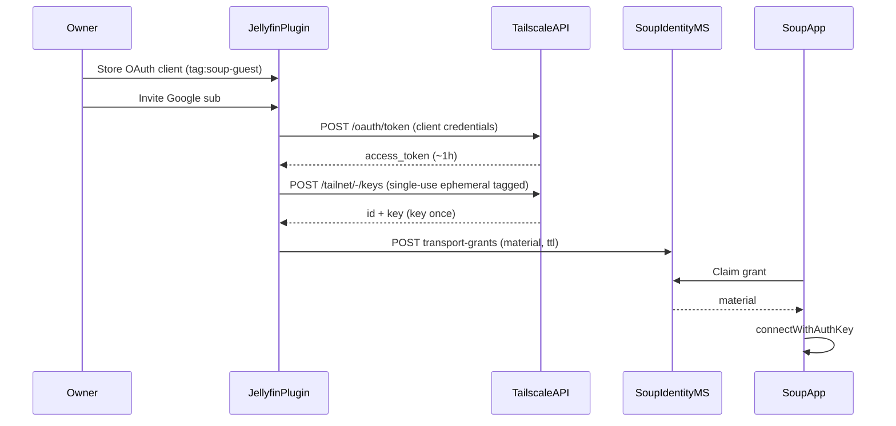

# Wave 1C spike — Tailscale auth-key mint + ACL scope

Date: 2026-09-10  
Worktree: `jeffreyroulston-stuff`  
Related: [`docs/ideas/soup-entitlement-mailbox.md`](../ideas/soup-entitlement-mailbox.md), Wave 0 stubs in `services/soup-identity/`

## Verdict

**Minting belongs in the Jellyfin plugin (or a colocated server-side agent), not in Soup.** The owner supplies a Tailscale OAuth client (preferred) or API access token; the plugin calls Tailscale’s Keys API to create a **single-use, ephemeral, preauthorized, tagged** auth key, then deposits that key material into Soup as a one-time transport grant (Wave 2). Soup never holds the owner’s Tailscale credentials and never dials Tailscale’s control plane on the owner’s behalf.

Live API exercise was **not** run: no `TAILSCALE_*` / `TS_API_*` secrets are present in this environment. Exact request sequences and failure modes are documented below from Tailscale’s public API docs ([Keys API](https://github.com/tailscale/tailscale/blob/main/api.md), [OAuth clients](https://tailscale.com/kb/1215/oauth-clients), [tags](https://tailscale.com/kb/1068/acl-tags), [auth keys](https://tailscale.com/kb/1085/auth-keys)).

---

## 1. Who mints, and how

### Responsibility split

| Actor | Holds | Does |
| --- | --- | --- |
| Owner (human) | OAuth client ID/secret **or** user API token; tailnet ACL edits | Creates credentials scoped to guest tags; pastes into Jellyfin plugin settings |
| Jellyfin plugin / agent | Owner credentials (encrypted at rest on home server) | Mints auth key per invite; deposits grant on Soup; can revoke unused keys via DELETE |
| Soup identity MS | Grant ciphertext / material only | Stores TTL + single-claim mailbox; returns material once to entitled app |
| Soup app (`connectWithAuthKey`) | Claimed `tskey-auth-…` once | Passes into embedded libtailscale; never re-uploads to Soup |

This matches Pattern A: **outbound only** (plugin → Soup). Soup does not call Jellyfin or Tailscale with owner credentials.

### Preferred credential: OAuth client (`auth_keys`)

Prefer a **tailnet-owned OAuth client** over a long-lived user API token (`tskey-api-…`):

- Client secret is `tskey-client-…`; access tokens are short-lived (~1h).
- Scope: **`auth_keys`** (and only that, unless Wave 4 needs device revoke via `devices:core`).
- When creating the client, bind it to **`tag:soup-guest`** (or a tag-owner tag that owns `tag:soup-guest`).
- Auth keys minted via OAuth **must** include tags; those tags must match the client’s allowed set (or be owned by the client’s tags).

User API tokens can mint untagged keys (nodes inherit the user). That is a poor fit for guest TVs: the guest device would appear as the owner’s identity.

### Mint flow (plugin)



### Recommended auth-key capabilities

| Field | Value | Why |
| --- | --- | --- |
| `reusable` | `false` | One guest device per invite/claim; aligns with Soup single-claim |
| `ephemeral` | `true` | Guest TV/phone node disappears when offline long enough; limits orphaned machines |
| `preauthorized` | `true` | No admin click on Machines page for every invite (home UX) |
| `tags` | `["tag:soup-guest"]` | ACL identity for guests; required for OAuth-minted keys |
| `expirySeconds` | `900`–`3600` (recommend **1800**) | Key must be claimed + used quickly; unused keys auto-expire |
| `description` | e.g. `soup-{shortSub}` | ≤50 alnum/`-`/`_`; aids admin console audit |

**Note on tagging guest appliances:** Tailscale’s tag docs discourage tagging personal end-user devices that should carry a human identity. Soup guest nodes are **embedded appliance nodes** (Chromecast / TV / phone app node) joining without a Tailscale browser login — closer to ephemeral CI nodes than to a family member’s laptop. Tagged ephemeral guests are the correct Pattern A fit.

---

## 2. ACL / tag constraints for guest Soup devices

### Policy sketch (owner home tailnet)

Define tags and least-privilege grants so `tag:soup-guest` can reach **only** the Jellyfin host (and optional MagicDNS), not the rest of the LAN or other tagged services.

```json
{
  "tagOwners": {
    "tag:soup-jellyfin": ["autogroup:admin"],
    "tag:soup-guest": ["autogroup:admin", "tag:soup-jellyfin"]
  },
  "grants": [
    {
      "src": ["tag:soup-guest"],
      "dst": ["tag:soup-jellyfin"],
      "ip": ["8096", "8920", "443"]
    }
  ]
}
```

Notes:

- Prefer **grants** over legacy `acls` when the tailnet supports them; same intent either way.
- Tag the Jellyfin machine (or the host running Tailscale + Jellyfin) as `tag:soup-jellyfin`. Guests must not get `autogroup:member`-style “talk to everyone.”
- Do **not** grant guests subnet-router routes, exit nodes, or SSH to user devices.
- If Jellyfin is only reachable via MagicDNS on the tagged host, keep ports limited to HTTP/HTTPS Jellyfin listens on (8096/8920/443 as deployed).
- Optional: a second tag `tag:soup-guest-ephemeral` is unnecessary if all guest keys already set `ephemeral: true`.
- OAuth client used by the plugin should be allowed only `tag:soup-guest` (or a tag-owner tag that owns it), so a compromised plugin cannot mint `tag:soup-jellyfin` or admin-capable keys.

### Device lifecycle

| Event | Tailscale effect | Soup effect |
| --- | --- | --- |
| Grant unused past TTL | Auth key expires; DELETE optional | Grant `expires_at` → unclaimable |
| Claim + successful `up` | Ephemeral tagged node appears | `claimed_at` set; material cleared from responses |
| Guest offline (ephemeral) | Node auto-removed after Tailscale ephemeral timeout | Entitlement can remain; new grant needed for re-join |
| Owner revokes invite | Plugin DELETE unused key + Soup DELETE entitlement | Roster row gone; no silent re-exchange |

Revocation latency (TTL vs plugin DELETE vs both) remains Wave 4; recommend **both**: short `expirySeconds` on the Tailscale key **and** Soup grant TTL, plus DELETE on revoke.

---

## 3. Wave 2 transport-grant deposit — recommended fields

Align with existing OpenAPI stubs (`TransportGrantDeposit` / `TransportGrantRecord`) and `transport_grants` migration, with a few additions for mint metadata.

### Plugin → Soup deposit (`POST …/transport-grants`)

| Field | Required | Type | Recommendation |
| --- | --- | --- | --- |
| `grant_type` | yes | enum | `tailscale_auth_key` (keep schema open for later transports) |
| `material` | yes | string | Full `tskey-auth-…` from Tailscale create response (once) |
| `ttl_seconds` | yes | int ≥ 60 | **≤ Tailscale `expirySeconds`**; suggest `min(1800, expirySeconds - 60)` so Soup expires first |
| `tailscale_key_id` | no (recommend) | string | Tailscale key `id` (e.g. `k123456CNTRL`) for later DELETE without parsing material |
| `capabilities` | no | object | Echo of mint flags for audit: `{ reusable, ephemeral, preauthorized, tags }` |
| `single_claim` | no | bool | Default **true**; Wave 2 should enforce one successful claim |

### Soup storage / claim semantics

| Rule | Detail |
| --- | --- |
| Single-claim | Atomic `UPDATE … SET claimed_at = now() WHERE claimed_at IS NULL AND expires_at > now()`; second claim → 404/410 |
| Material visibility | Plugin list endpoint: **omit** `material`. App claim / roster: return `material` **only** on first successful claim (or once in `transport_grant` then null) |
| Replace policy | New deposit for same `(server_id, google_sub)` should invalidate prior unclaimed grants (soft-delete or mark expired) |
| Encryption at rest | Treat `material` as secret (same class as refresh tokens); Wave 2 should encrypt column or use KMS |

### App-facing claim shape (roster / dedicated claim)

When an unclaimed grant exists, roster `transport_grant` (or `POST …/claim`) should expose:

```json
{
  "id": "uuid",
  "grant_type": "tailscale_auth_key",
  "expires_at": "2026-09-10T12:00:00Z",
  "material": "tskey-auth-…",
  "claimed_at": null
}
```

After claim, subsequent roster reads return `"transport_grant": null` (or `claimed_at` set without `material`).

### App consumption

`packages/soup_tailscale` already exposes `connectWithAuthKey({ authKey })` → `tailscale_set_authkey`. Wave 2 app path: claim → `connectWithAuthKey` → discovery / MagicDNS to Jellyfin → assertion exchange. No interactive Tailscale QR for the entitlement path.

---

## 4. Exact API sequence (no live secrets)

Environment placeholders (do **not** invent values):

```bash
# Owner-provided — never commit
export TS_API_CLIENT_ID='tskey-client-…'      # or use user API token path below
export TS_API_CLIENT_SECRET='tskey-client-…'
export TAILNET='-'                            # shorthand OK for OAuth tokens
# Optional alternate:
# export TS_API_TOKEN='tskey-api-…'
```

### A. OAuth access token

```bash
curl -sS -X POST 'https://api.tailscale.com/api/v2/oauth/token' \
  -d "client_id=${TS_API_CLIENT_ID}" \
  -d "client_secret=${TS_API_CLIENT_SECRET}"
```

Expected success (~200):

```json
{
  "access_token": "tskey-…",
  "token_type": "Bearer",
  "expires_in": 3600,
  "scope": "…"
}
```

```bash
export TS_ACCESS_TOKEN='…from response…'
```

### B. Create single-use guest auth key

```bash
curl -sS -X POST "https://api.tailscale.com/api/v2/tailnet/${TAILNET}/keys" \
  -H "Authorization: Bearer ${TS_ACCESS_TOKEN}" \
  -H 'Content-Type: application/json' \
  --data-binary '{
    "capabilities": {
      "devices": {
        "create": {
          "reusable": false,
          "ephemeral": true,
          "preauthorized": true,
          "tags": ["tag:soup-guest"]
        }
      }
    },
    "expirySeconds": 1800,
    "description": "soup-guest-invite"
  }'
```

Equivalent Basic auth form (user API token or access token as username, empty password):

```bash
curl -sS -X POST "https://api.tailscale.com/api/v2/tailnet/${TAILNET}/keys" \
  -u "${TS_ACCESS_TOKEN}:" \
  -H 'Content-Type: application/json' \
  --data-binary '{ …same body… }'
```

Expected success (~200): JSON including `"id"` and `"key"` (`tskey-auth-…`). **`key` is returned only once.**

### C. Optional revoke unused key

```bash
curl -sS -X DELETE \
  "https://api.tailscale.com/api/v2/tailnet/${TAILNET}/keys/${KEY_ID}" \
  -H "Authorization: Bearer ${TS_ACCESS_TOKEN}"
```

### D. Deposit into Soup (Wave 2 — currently stub `501`)

```bash
curl -sS -X POST \
  "https://<soup-host>/v1/servers/<serverId>/entitlements/<googleSub>/transport-grants" \
  -u '<plugin_id>:<plugin_secret>' \
  -H 'Content-Type: application/json' \
  --data-binary '{
    "grant_type": "tailscale_auth_key",
    "material": "tskey-auth-…",
    "ttl_seconds": 1700,
    "tailscale_key_id": "k…CNTRL"
  }'
```

Wave 0/1 stub: expect **501** with message that transport grants land in Wave 2.

---

## 5. Failure modes

| Stage | Symptom | Likely cause | Plugin / owner action |
| --- | --- | --- | --- |
| OAuth token | 401 / invalid_client | Bad client ID/secret | Re-paste credentials; regenerate secret in admin console |
| OAuth token | 403 / insufficient scope | Client missing `auth_keys` | Recreate client with `auth_keys` + guest tag |
| Create key | 400 tags invalid / not permitted | `tag:soup-guest` missing from ACL `tagOwners`, or not allowed on OAuth client | Add tagOwners; recreate OAuth client with that tag |
| Create key | 400 / capability errors | Malformed `capabilities.devices.create` | Ensure nested object matches API (not flat scopes) |
| Create key | 401 | Expired access token | Refresh OAuth token (1h lifetime) |
| Create key | 403 | Token lacks permission to mint | Use Admin/Network-admin-capable credential path |
| Join (`connectWithAuthKey`) | Auth key already used | Reusable=false + double claim or retry | Mint + deposit a new grant |
| Join | Auth key expired | Past `expirySeconds` or Soup TTL | Re-invite / remint |
| Join | Connected but cannot reach Jellyfin | ACL too tight / wrong tag on JF host / wrong ports | Fix grants; confirm JF host has `tag:soup-jellyfin` |
| Join | Device pending approval | `preauthorized: false` or policy requires approval | Mint with `preauthorized: true` or approve in admin console |
| Soup deposit | 501 | Wave 2 not implemented | Expected until Wave 2 |
| Soup claim | Empty / already claimed | Race or prior device claimed | Remint; enforce single-claim atomically |

---

## 6. Out of scope / left for later

- **Wave 2 implementation** of deposit, encrypt-at-rest, claim endpoint, and OpenAPI field additions (`tailscale_key_id`, replace semantics).
- **Live mint** against a real tailnet (needs owner secrets).
- **Plugin settings UI** for OAuth client storage and invite-triggered mint.
- **Wave 4 revocation** orchestration (DELETE key + entitlement + ephemeral node cleanup).
- Non-Tailscale transport grant types (schema stays generic).

## 7. Wave 2 checklist (from this spike)

1. Plugin setting: OAuth client ID/secret + default tags + default `expirySeconds`.
2. On invite (or explicit “deposit transport”): mint key → POST grant with TTL ≤ key expiry.
3. Soup: implement single-claim storage; omit material from plugin list; return once to app.
4. App: claim → `connectWithAuthKey` → reach tagged Jellyfin → assertion exchange.
5. Owner runbook: ACL snippet above + OAuth client creation steps.
