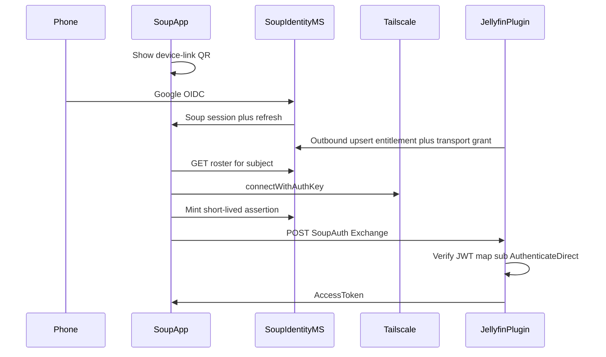

# Soup Entitlement Mailbox

## Problem

How might we let a Jellyfin plugin publish private reachability and a short-lived sign-in path to a tiny Soup service, so an invited family member can log into Soup once and reach playback in ~60s — without exposing Jellyfin publicly or letting Soup dial into the home?

## Approved direction (Pattern A)

Build a **thin Soup microservice** (identity + device link + expiring mailbox) and a **Jellyfin plugin** as the only admin UI and source of truth.

| Rule | Detail |
| --- | --- |
| Thin MS | Soup holds Google identity, Netflix-style sessions, roster/mailbox, and short-lived JWT assertions. No Soup admin/invite UI. |
| Plugin UI only | Owners invite and revoke inside Jellyfin. Existing Jellyfin SSO plugins may map Google↔Jellyfin users inside the plugin; Soup does not replace SSO. |
| Outbound only | **Jellyfin → Soup**. Soup **never** calls Jellyfin. |
| Join key | Google OIDC `sub` links Soup login to plugin entitlement rows. |
| Pattern A | App mints a Soup-signed assertion; plugin verifies via JWKS, maps `sub` → Jellyfin user, `AuthenticateDirect`, returns a normal Jellyfin access token. |
| Transport | Plugin may deposit a one-time **Tailscale auth-key** grant (TTL + single-claim). Generic grant blob; Tailscale first. |
| Sessions | Long-lived Soup refresh sessions. Jellyfin re-auth while Soup session is valid = **silent** assertion re-exchange (no Google UI). |
| Multi-server | API is always `servers[]`. v1 app auto-selects the sole/first server; picker is v2. |

### Not in mailbox

- Quick Connect codes
- Long-lived Jellyfin passwords
- Anything that requires Soup to call Jellyfin

### Flow (invite path)

1. TV shows Soup device-link QR → phone completes Google OIDC → Soup issues session + refresh.
2. Plugin (outbound) registers server, entitles Google `sub`, optionally deposits a Tailscale auth-key grant.
3. App `GET /v1/me/servers` → claim transport grant if present → `connectWithAuthKey`.
4. App `POST /v1/assertions` → plugin `POST /SoupAuth/Exchange` → save Jellyfin session → library.
5. Cold start: restore Soup session; if Jellyfin token fails, silent re-exchange; Google UI only if Soup refresh is dead.

## MVP scope

- **Soup MS** (`services/soup-identity`): Google device-link, sessions/refresh, JWKS, assertions, roster/entitlement CRUD, plugin credentials; transport-grant storage lands in Wave 2.
- **Jellyfin plugin**: invite/revoke UI, outbound upsert, `/SoupAuth/Exchange`.
- **Soup app**: device-link → roster → auth-key connect → exchange → silent restore.

## Explicitly out of scope (v1)

- Soup admin/invite UI
- Soup → Jellyfin callbacks
- Multi-server picker polish (list shape only)
- Replacing Jellyfin web SSO
- Non-Tailscale transports (keep grant schema generic)
- QC or password artifacts in the mailbox

## Open questions (deferred)

- Who mints Tailscale auth keys (plugin + owner API token) — Wave 1C/2
- Exact ACL/tag scope for guest devices — Wave 1C
- Revocation latency: TTL + plugin DELETE (both) — settled in Wave 4
  ([android-soup-hardening-wave4-2026-09-10.md](../development/android-soup-hardening-wave4-2026-09-10.md))

## Implementation home

| Path | Role |
| --- | --- |
| `services/soup-identity/` | Thin MS (this wave) |
| `plugins/jellyfin-soup/` | Jellyfin 10.11 plugin (later wave) |
| `apps/android/` | Soup onboarding + silent re-auth (later wave) |
